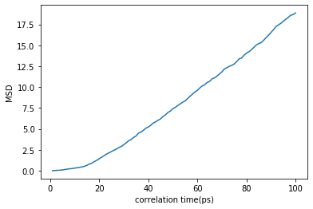
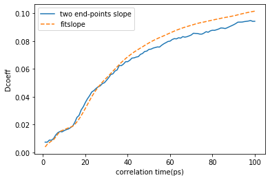

```python
import pandas as pd
import numpy as np
import matplotlib.pyplot as plt
```


```python
datafile = open('log.lammps', 'r', encoding='utf-8')
datas = datafile.readlines()
#print(type(datas))
datalist = []
for i in range(len(datas)-1):
    datas[i] = ' '.join(datas[i].split())
    datalist.append(datas[i])

#print(datalist)
    
datafile.close()


datafile = open('log.txt', 'w')

data = '\n'.join(datalist)

datafile.write(data)

datafile.close()

```


```python
contents = pd.read_csv('log.txt', sep=' ')
contents = contents.drop(0)
contents.head()
```


<div>
<style scoped>
    .dataframe tbody tr th:only-of-type {
        vertical-align: middle;
    }

    .dataframe tbody tr th {
        vertical-align: top;
    }

    .dataframe thead th {
        text-align: right;
    }
</style>
<table border="1" class="dataframe">
  <thead>
    <tr style="text-align: right;">
      <th></th>
      <th>Step</th>
      <th>Temp</th>
      <th>c_msd[4]</th>
      <th>v_twopoint</th>
      <th>v_fitslope</th>
    </tr>
  </thead>
  <tbody>
    <tr>
      <td>1</td>
      <td>1000</td>
      <td>378.83040</td>
      <td>0.044362</td>
      <td>0.007394</td>
      <td>0.003937</td>
    </tr>
    <tr>
      <td>2</td>
      <td>2000</td>
      <td>401.50889</td>
      <td>0.088555</td>
      <td>0.007380</td>
      <td>0.005868</td>
    </tr>
    <tr>
      <td>3</td>
      <td>3000</td>
      <td>434.49217</td>
      <td>0.160173</td>
      <td>0.008898</td>
      <td>0.007110</td>
    </tr>
    <tr>
      <td>4</td>
      <td>4000</td>
      <td>479.91498</td>
      <td>0.210725</td>
      <td>0.008780</td>
      <td>0.008245</td>
    </tr>
    <tr>
      <td>5</td>
      <td>5000</td>
      <td>521.09929</td>
      <td>0.300253</td>
      <td>0.010008</td>
      <td>0.009190</td>
    </tr>
  </tbody>
</table>
</div>


```python
step = contents['Step']/1000

msd = contents['c_msd[4]']/3

plt.figure()

plt.xlabel("correlation time(ps)")

plt.ylabel("MSD")

plt.plot(step, msd)

plt.show()
```





```python
step = contents['Step']/1000

v_twopoint = contents['v_twopoint']

v_fitslope = contents['v_fitslope']

plt.figure()

plt.xlabel("correlation time(ps)")

plt.ylabel("Dcoeff")

plt.plot(step, v_twopoint, linestyle='-', label='two end-points slope')

plt.plot(step, v_fitslope, linestyle='--', label='fitslope')

plt.legend(loc="upper left")

plt.show()
```





```python

```
